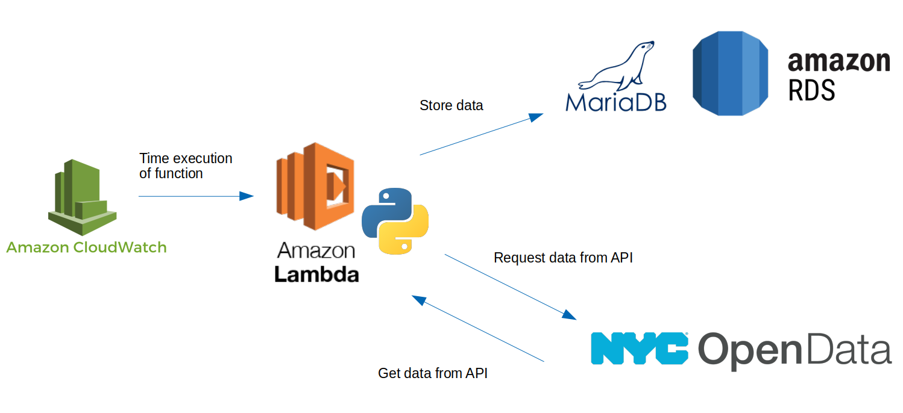

# Data Warehousing Final Project: *NYC at a Glance* 
### Yabra Muvdi, Kristin Lomicka, Vivek Kaiwen
​
​For this project we are going to collect data from New York City's [Open Data API](https://opendata.cityofnewyork.us/) in order to provide an overview of different aspects of the city in the previous week. To do this, we will build a datawarehousing architecture that relies mainly on Amazon Web Services (AWS). The diagram below depicts this structure.

The sections below describe the required steps to setup the architecture.​

## Setting up an AWS Relational Databases
First we need to create a database instance on [AWS RDS](https://aws.amazon.com/es/rds/). This requires an AWS account. Once the account is setup the following steps are required:

1. Choose *MariaDB* version 10.2.21 as the Engine option
2. Choose the *free tier* template
3. Choose the identifier for the database and setup credentials. **Remember them!**
4. Allow public access
5. Create an initial database (e.g. *big_apple*)

After the database instance is created we need to allow for the source of the traffic to come from anywhere. Alternatively, we can edit the security setting to only allow traffic coming from the IP address of the creator of the database. At this stage we are going to use the former approach:

1. On the RDS Dashboard click on the database instance we just created
2. Click on the VPC security group
3. Click on *inbound*
4. Click *edit* and allow the *source* to come from *Anywhere*

## Creating a Lambda Function

Now that we have a MariaDB database running on AWS RDS we need to work with [AWS Lambda](https://aws.amazon.com/es/lambda/features). This service will allow us to execute a python script on a regular basis. In our case, the python script will mainly connect to the New York City Open Data API, extract the data of interest, connect to the previously created MariaDB instance and store the data as tables of the database. To setup this Lambda Function we need the following steps:

1. Upload the deployment package provided (zipped folder containing the python script and the used python modules)
2. Set *Memory* to 512 MB and *Time* to the desired frequency for running the function

## Creating a Cloudwatch Event

Next, we create a [AWS Cloudwatch Event](https://aws.amazon.com/cloudwatch/) to time the execution of the Lambda function previously created.

1. Create a new *rule*
2. Set schedule to *daily* and select the Amazon Lambda function previously created
3. Enable the *timer*
​
The script will now run daily and update our database!
